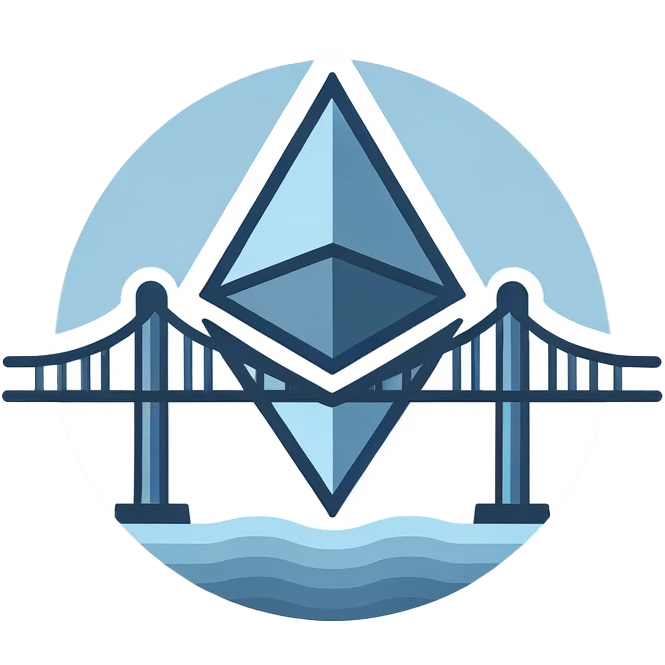
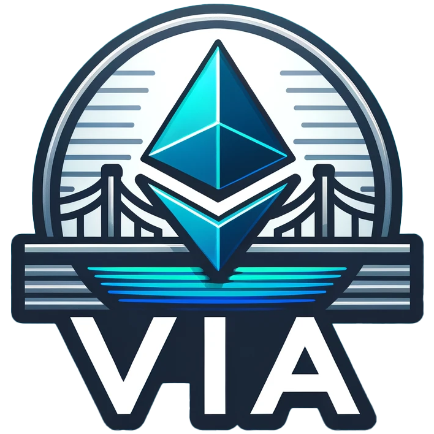

# SaferBridge - Trust Minimized L2 Bridge
<!-- # Via  - Trust Minimized L2 Bridge
# ViaDuck  - Trust Minimized L2 Bridge -->
Unlike all other L2 to L2 cross chain bridges, SaferBridge transfers funds directly via L1 using the L2s native message passing, and doesn't rely on any relayers or LPs. Additionally, because of it's design, you can always force your transaction, and don't have to trust any 3rd party.

We did not build L2 ecosystems to use cross chain bridges, the whole point was to maintain trust assumptions.

## What's Wrong With Current 3rd Party L2 Bridges?

If your bridge don't use the native bridges to go from L2 to L2, most 3rd party bridges have the same security assumptions as cross-chain bridges. Simply put, they are all more or less trusted shit. Please see <a href="https://www.youtube.com/watch?v=EAkOHyWPI4o" target="_blank">Daniel Lumi's speech from ETH CC for more information</a>.

## 2 Transfer Modes

In <b>Normal Speed</b> mode your transaction will be batched with 10 users. The bridging transaction will initiate automatically without a relayer when the batch fills up. This means you will only cost 1/10 of all of the normal gas fees of bridging safely from L2 -&gt; L1 -&gt; L2!

In <b>Fast Speed</b> mode your transaction will submitted to the L2 bridge as soon as you make it. Any outstanding transactions in a batch will be submitted with yours. This means it will only cost you the remainder of the batch. Right now there are {Math.round( props.batchProgress / 10 )}/10 spots filled up in the batch, meaning you only have to pay {10 - Math.round( props.batchProgress / 10 )}/10 of all of the normal gas fees of bridging safely from L2 -&gt; L1 -&gt; L2!

## No Relayers & Minimal Trust Assumptions

Safer Bridge does not require any relayers. Unlike other cross chain bridges, which rely on trusted actors, every single part of the bridging process is trustless outside of the existing trust assumptions of using a native L2 bridge (...or if we fuckup in the smart contract programming ;). 

1. Batch L2 -> L1 - Each person joining the batch pays an estimated gas fee + a surcharge incase gas price changes (+xx%). The last person joining the batch only pays estimated gas fee (no surcharge), and pushes the whole batch to the native L2 to L1 bridge. Effectively other users pre-pay for the extra cost incurred by the last person to join.
2. Claim on L1 -> Send to L2 - Any person in the batch can trigger the claim & move from the first L2 bridge contract to the next one. This step can be incentivized, or simply rely on socio-economic factors of who needs the funds first.
3. Distribute assets on L2 - The first person to claim the funds on the final location disburses all of the assets in the batch to all of the respective parties who were part of the batch. This step can be incentivized, or simply rely on socio-economic factors of who needs the funds first.

While we could employ relayers (which would still be trustless, but need external actors), each of these steps were delibirately designed in SaferBridge to be user triggered and not rely on any external actors. The whole point of L2s was not to rely on cross chain bridges or have additional trust assumptions. 'This is the way'.

## No Transaction Fees!

SaferBridge is not a business, it is a public good. Outside of incentivizing the 3 steps above (which we hope L2s will subsidize in the future - see "The Future" section below), we designed SaferBridge to be completely 'free' for users outside of ammortized gas cost. The protocol itself will not charge any fee, there will not be any ponzi pretend governance token, and the contracts will be completely immutable without contract owners that can claim any excess surcharges.

## Ammortized Cost Per User

While calldata goes up linearly with the size of the batch, the savings per user for bridging is <u>atleast</u> 38% cheaper per user (based on our extremely non scientific 2min test while running, admittedly rushed, through this hackathon). As the batch size increases, the fee for each user drops. 

At the very least, this is still better UX than each user needing to sign many messages and enter many URLs, to bridge by themselves.

## The future

We want L2s to fork this & build it into their native canonical bridges. While it is possible this bridge will need to remain external, this is not the future we hope for.

Any of the above 3 steps that currently rely on incentivization or socio-economic considerations can be handled by the native L2 actors. It is in their benefit to vampire attack other protocols liquidity by subsidizing users to move liquidity to their L2 from another one, and it may also be in their benefit to provide users good user experience for moving funds away. Even if the former is only true, each protocol could subsidize users to move liquidity to their L2 from another one, and if every L2 adopts this method, moving in each direction would be 'free' outside of ammortized gas cost to users.

## Note On Centralized Asset Types

For USDC, instead of using the batching mechanism outline above, we would use Circles native <a href="https://www.circle.com/en/cross-chain-transfer-protocol" target="_blank">Cross-Chain Transfer Protocol (CCTP)</a>. Any centralized asset already entirely relies on the centralized party to mint & burn assets. Because of this, it makes more sense to use their canonical bridge.

For all other assets (including USDT which doesn't have a native bridge), we use the batching mechanism outlined above.